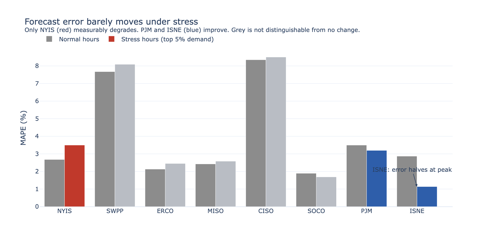
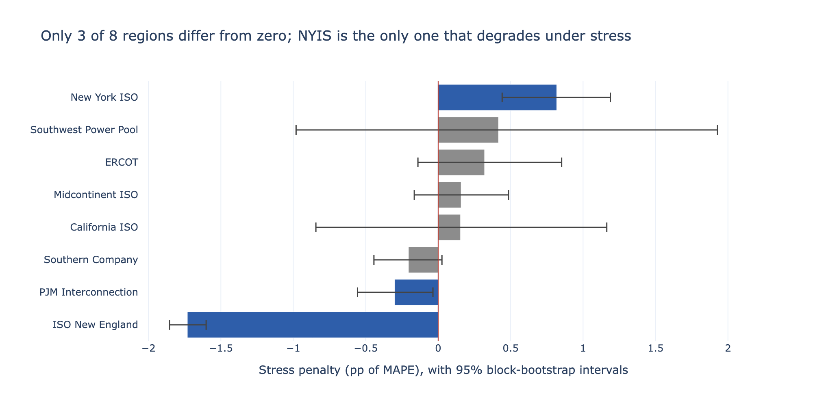
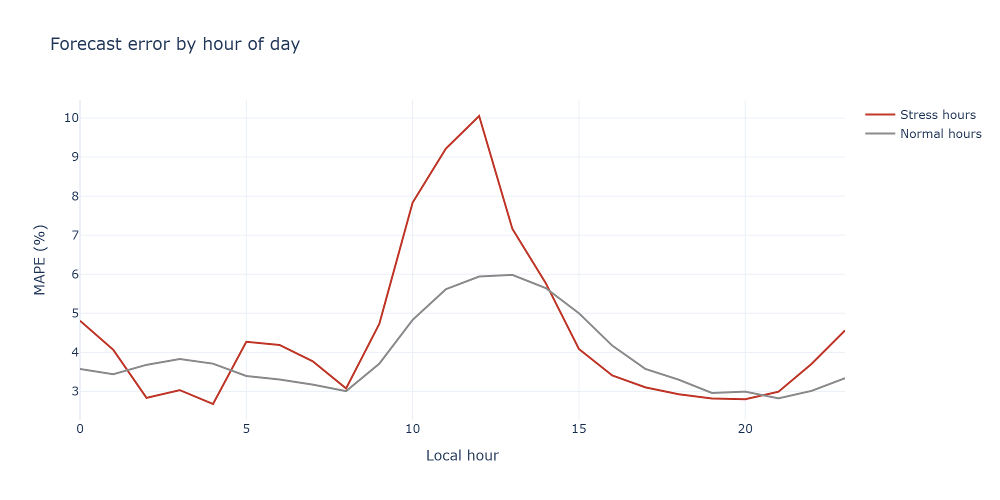
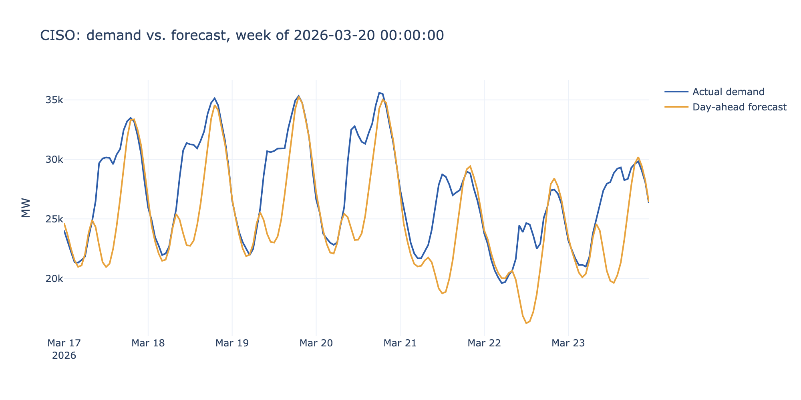
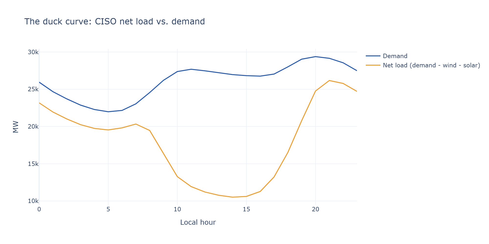

# United States Energy Grid Stress Analysis

Does the U.S. power grid forecast demand worst on the hours when being wrong
costs the most? Two years of hourly data across eight regional grid operators
say mostly no, with one real exception and a couple of surprises underneath.

**[Open the live, interactive dashboard](https://josealemanm.github.io/united-states-energy-grid-stress-analysis/powerbi/dashboard.html)**
No installation needed. It runs in the browser. The full Power BI project with
slicers and cross-filtering is also in the repo; see
[The Power BI report](#the-power-bi-report) below.



## Why the question matters

Electricity has to be produced at the moment it is consumed. There is almost no
storage on the system, so somebody has to guess tomorrow's demand today and
schedule power plants against that guess.

In the United States that job belongs to **balancing authorities**: regional
operators like PJM (the mid-Atlantic), ERCOT (Texas), and CISO (California).
Each one publishes a **day-ahead forecast**, an hour-by-hour prediction of how
much electricity its region will draw tomorrow, and commits generators to meet
it.

Being wrong costs money in both directions:

- **Forecast too low.** The shortfall has to be bought in the real-time market
  within the hour, usually at a much higher price than the day-ahead price.
- **Forecast too high.** Plants get started that turn out not to be needed, and
  somebody pays for the fuel and the wear.

The direction that worries operators is the first one, and the hours that worry
them are the highest-demand hours of the year: a July afternoon when every air
conditioner in the region is running, or a January morning after a cold snap.
On those hours the system has the least spare capacity, prices are at their
highest, and a forecast miss is hardest to cover.

So the natural fear is that forecasts fail precisely then, when accuracy is
worth the most. This project tests that.

**The question, stated exactly:** when a balancing authority is in the top 5%
of its own demand, does its day-ahead forecast error rise compared with its
ordinary hours, and by how much?

## What the dashboards show

Six report pages, built twice: as a Power BI project in `powerbi/` and as a
self-contained HTML page at [`powerbi/dashboard.html`](powerbi/dashboard.html).
Both read the same star schema and show the same measures. The charts below are
from the HTML build.

### The headline comparison

The image at the top of this page. Two bars per region: gray for ordinary
hours, colored for stress hours. If the fear were right, the second bar would
stand clear of the first everywhere. It does so once.

### Is the difference real, or is it noise?



The same result with uncertainty attached. Each bar is the change in error at
stress hours; each whisker is a 95% confidence interval. Bars whose interval
crosses the red zero line are gray, because the data cannot tell them apart
from no effect at all. Five of eight land there. This chart is the reason the
project exists in the form it does: the ranking you get from the bars alone is
not the ranking you get once the intervals are drawn.

### When during the day the error happens



Error against hour of the local day, split by stress and normal hours. Both
curves rise through the morning and peak around midday, and the gap between
them opens in the same window. Overnight the two are close, and at some hours
stress-hour error is the lower of the two.

### One week, hour by hour



A single region over a single week, actual demand against the forecast
published the day before. The daily shape is tracked well. The misses cluster
in the troughs and on the shoulders of each day's peak, and they run in blocks
of several hours rather than as isolated bad hours.

### Why "stress" has more than one meaning



Demand against **net load**, which is demand minus the wind and solar output
that cannot be dispatched on command. In California the gap between the two
lines is solar, and the steep evening climb as the sun sets is the well-known
"duck curve." An operator can be strained by how high load is or by how
fast net load is moving, and those are different hours. The report measures
both, and they disagree about which regions have a problem.

## What the data says

Pooled across all eight regions, the effect is a wash: 3.88% mean error at
stress hours against 3.93% at normal hours. Once confidence intervals are
attached, only three of eight regions show any effect distinguishable from
zero, and two of those three get better at their own peak.

The exception is New York ISO, which degrades by 0.82 percentage points
(interval [+0.44, +1.19]). It is also importing 2,399 MW during its own peak
hours, so its misses arrive when its own spare capacity is thinnest. On the
other side, ISO New England's error falls to 0.4x normal at peak.

The number I would have gotten wrong without intervals: Southwest Power
Pool has the second-largest point estimate at +0.42 points, which reads like
a finding until the interval turns out to be [-0.98, +1.93]. Ranking the eight
regions on point estimates alone puts the wrong region first.

Three further results changed how I read all of the above.

The forecasts are better than the raw error suggests. Measured against a
naive baseline of "yesterday's demand at the same hour," the day-ahead forecast
removes 26% of the baseline's error at normal hours and 32% at stress hours.
Skill goes up under stress, because the naive baseline falls apart faster
than the real forecast does on unusual days. Two regions score negative skill,
CISO and SWPP, meaning their published day-ahead numbers do worse than simply
reusing yesterday.

The answer depends on which definition of stress you use. Define a stress
hour by how fast net load is ramping rather than how high demand is, and you
get a nearly disjoint set of hours (5-12% overlap) and a different ranking. Two
regions come out with a ramp penalty that clears zero, and they disagree about
its size. Southern Company's point estimate is larger at +1.85 points, but its
interval runs [+0.38, +4.56], the widest in the study. PJM's is +1.78 on an
interval eight times narrower, [+1.52, +2.04], and PJM is one of the regions
that improves under the demand definition.

Most of the error runs one direction. MAPE discards the sign of the miss.
Put it back, and seven of the eight regions miss the same way in more than 65%
of their hours. CISO's average signed error is -6.95 points against an 8.36
MAPE, so most of what gets counted as its forecast error is a standing offset
rather than noise. SWPP is the mirror image, running high by +6.14. Only ERCOT
is anywhere near balanced, at 58%. A forecast that leans one way almost every
hour is a calibration problem, which is cheaper to fix than a modeling problem.

The one-page write-up for a non-technical reader is
[`reports/memo.pdf`](reports/memo.pdf).

## Reading the numbers

Enough to follow the findings above, and enough to know exactly what was
computed.

**MAPE (mean absolute percentage error)**: the average size of the forecast
miss as a percentage of actual demand, ignoring whether the miss was high or
low. A MAPE of 3.9% means the typical hour was off by about 3.9% of that hour's
demand.

**Stress hour**: an hour in the top 5% of demand for that balancing authority,
within that season. Percentile within region so a small grid is not judged
against ERCOT on raw megawatts. *Within season* so a summer-peaking region and
a winter-peaking one are not compared on climate. Top 5% rather than top 1% so
that every region keeps enough stress hours for the average to mean something:
6,961 hours across the eight regions.

**Stress penalty**: MAPE at stress hours minus MAPE at normal hours, in
percentage points. Positive means the forecast is worse when the grid is
loaded.

**95% confidence interval**: the range the penalty could plausibly take given
how much the data bounces around. Computed by block bootstrap, resampling whole
calendar days rather than individual hours, because forecast errors within a
day are strongly correlated. Resampling by hour would treat 24 related errors
as 24 independent observations and produce intervals far too narrow. An
interval that contains zero means the data cannot rule out "no effect."

**Skill score**: how much of a naive baseline's error the real forecast
removes, as a fraction. The baseline is 24-hour persistence: yesterday's demand
at the same hour, which costs nothing to produce. Zero means the forecast is no
better than that. Below zero means it is worse.

**Net load**: demand minus wind and solar generation. It is what the
dispatchable plants actually have to follow, since wind and solar cannot be
turned up on request.

## The data

| | |
|---|---|
| Source | U.S. Energy Information Administration, Form EIA-930, API v2 |
| Regions | PJM, MISO, CISO, ERCOT, ISO New England, New York ISO, Southwest Power Pool, Southern Company |
| Window | 24 months, September 2024 to September 2026 |
| Grain | Balancing authority x hour |
| Volume | 559K region rows, 1.23M fuel rows, 1.79M total |
| After filtering | 139,055 balancing-authority-hours |

EIA-930 is the mandatory hourly report every U.S. balancing authority files.
For each hour it carries actual demand, the day-ahead forecast published for
that hour, net generation, interchange with neighboring regions, and a
generation breakdown by fuel.

## How it's built

1. **Pull** (`src/01_pull.py`): pages through the EIA API with retry and
   backoff, writes raw parquet plus a manifest recording exactly what was
   pulled and when.
2. **Validate** (`src/02_validate.py`): completeness, duplicates, impossible
   values, robust outlier detection, and the EIA-930 balance-identity check
   (net generation minus interchange should equal demand). Writes
   [`reports/data_quality_report.md`](reports/data_quality_report.md).
3. **Model** (`src/03_build_warehouse.sql`): a DuckDB star schema with two fact
   tables at hourly grain, three dimensions, and two pre-computed analysis
   tables. Stress hours come from a window function taking the demand
   percentile within region and season.
4. **Quantify uncertainty** (`src/03b_bootstrap_intervals.py`): 2,000
   day-block resamples per region, giving every headline number an interval.
5. **Export** (`src/04_export_for_bi.py`): writes the star schema to parquet
   in `data/processed/` for any BI tool to read.
6. **Report**: the Excel assumptions register (`src/05_...`), the HTML
   dashboard (`src/06_...`), the memo PDF (`src/07_...`), and the Power BI
   report pages (`src/08_...`).

`make help` lists each step. `make test` runs the suite.

Prefer to build it yourself end to end, by hand, rather than run the scripts?
[`docs/TUTORIAL_FROM_SCRATCH.md`](docs/TUTORIAL_FROM_SCRATCH.md) is the
original build guide: every pull, validation rule, SQL table and Excel
formula, click by click, written before the code existed. It predates the
bootstrap intervals, the ramp-stress lens and the current Power BI project, so
treat the numbers in it as illustrative and the code in `src/` as the source
of truth. Read it for the reasoning behind each step.

## The Power BI report

`powerbi/grid_stress.pbip` holds six pages over a star schema with 33 DAX
measures, all relationships many-to-one in a single filter direction.

It is a Power BI **project** rather than a `.pbix` file. The semantic model is
TMDL and the report pages are JSON, so every measure and every visual is
readable text that shows up in a diff, instead of a binary blob that produces
merge conflicts nobody can resolve. Open the `.pbip` in Power BI Desktop on
Windows and refresh once; all 1.37 million rows load in a few seconds.

[`docs/POWERBI_WINDOWS_GUIDE.md`](docs/POWERBI_WINDOWS_GUIDE.md) walks through
the model and the DAX for someone who has never opened Power BI, and explains
how to change the layout two ways: by dragging in Desktop, or by editing the
row heights and column weights at the top of `src/08_build_powerbi_report.py`.
Colors and font sizes live in `src/powerbi_theme.py`. `make powerbi` rebuilds
the pages from both.

## Running it yourself

```bash
git clone https://github.com/josealemanm/united-states-energy-grid-stress-analysis.git
cd united-states-energy-grid-stress-analysis
python3 -m venv .venv
source .venv/bin/activate          # Windows: .venv\Scripts\activate
pip install -r requirements.txt
cp .env.example .env               # then add your key, free at eia.gov/opendata
make all                           # pull (~15 min), validate, warehouse, memo
```

You can skip the pull entirely. The raw and processed parquet are committed
(about 31 MB), so a clone gives you the full dataset and the built star schema
with no API key. That is a deliberate exception to the usual rule against
committing data: it is small, it is what makes the repository openable by
someone who just wants to look, and it means the Power BI model loads on a
fresh machine. The 69 MB DuckDB warehouse stays excluded, since `make
warehouse` rebuilds it from the committed parquet in seconds.

Built and tested on Python 3.9.6. `requirements.txt` pins major versions;
`requirements.lock.txt` has the exact versions these numbers came from. Power
BI Desktop is Windows-only and optional; everything except
`powerbi/grid_stress.pbip` works without it.

## What's wrong with the data, and what I did about it

Full breakdown in
[`reports/data_quality_report.md`](reports/data_quality_report.md). Two issues
belong on the front page, because both change how a headline number should be
read.

CISO's reported numbers don't balance. Net generation minus interchange
should equal demand. For CISO it is off by more than 5% in 6,396 of the 17,304
hours where the check can be run. I reported it rather than correcting it,
since smoothing it over would hide a real limitation of the source.

That distinction matters more than it sounds. CISO's headline MAPE is 8.36%
overall but 6.95% on hours where the identity holds, and its stress penalty
flips from +0.15 to -1.67 points on that clean subset. Most of what looks like
poor CISO forecasting is a metering artifact, so any leaderboard ranking CISO
among the worst forecasters is really ranking its reporting quality.

SWPP has one broken day. I found it by checking whether any reported
forecast was implausibly small next to its own region's demand. For 24
consecutive hours, 01:00 on 2026-04-16 through midnight, SWPP's day-ahead
numbers sit between 5% and 34% of actual demand while its net generation tracks
demand normally. That is a broken field rather than a bad forecast. Removing
that single day cuts SWPP's stress penalty from +0.42 to +0.12 points, so the
+0.42 quoted above is mostly one day of bad data. Its negative skill score
barely moves (-0.77 to -0.74), so that separate finding stands on its own. I
left the day in and flagged it, consistent with how the balance failures are
handled.

An independent re-derivation of every headline number, and the four errors it
turned up in earlier drafts, is in
[`reports/audit_2026-09-03.md`](reports/audit_2026-09-03.md).

## Limitations

- MISO and SWPP each span more than one time zone. Each is assigned a single
  local zone anyway, which shifts some hours relative to true local time.
- These are the raw EIA series, not EIA's adjusted series, so reporting error
  stays visible instead of being smoothed away. That is why the CISO problem
  above is visible at all.
- The cost-per-MWh figure is a sourced assumption with a sensitivity range, not
  something measured here. The dollar figures are an upper bound: they assume
  every under-forecast megawatt is bought at the cited real-time price, when in
  practice reserves and demand response cover part of the gap.
- 24 months is a short window for conclusions that are ultimately weather
  driven. A notably hot or mild year could move the rankings.

## Repository map

| Path | What's in it |
|---|---|
| `src/` | The pipeline, numbered in run order |
| `data/raw/` | What came back from the EIA API, unmodified |
| `data/processed/` | The star schema as parquet, ready for any BI tool |
| `powerbi/` | The Power BI project, and the HTML dashboard |
| `reports/` | Memo, data-quality report, audit, bootstrap intervals, assumptions register |
| `docs/` | [`POWERBI_WINDOWS_GUIDE.md`](docs/POWERBI_WINDOWS_GUIDE.md), [`TUTORIAL_FROM_SCRATCH.md`](docs/TUTORIAL_FROM_SCRATCH.md), chart images |
| `tests/` | Pytest suite over the validation rules and the warehouse SQL |

## Stack

Python (pandas, requests, pyarrow, duckdb, numpy), SQL (DuckDB), Power BI
(TMDL semantic model, DAX, PBIR report definition), Plotly, and Excel.
